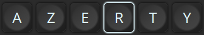
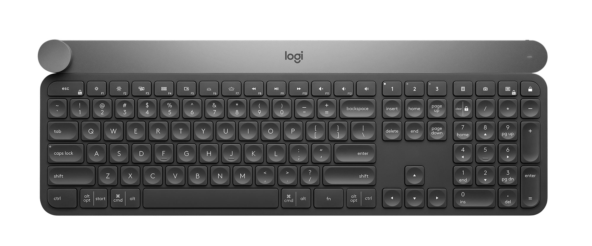
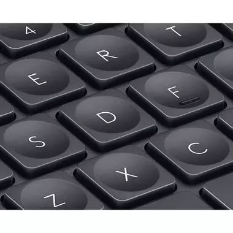
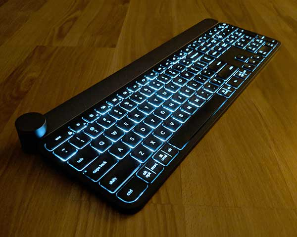

# Logitech KB styled css

This repo contains CSS that give a kind of keyboard design, freely inspired by Logitech CRAFT.

Any comments are welcome, any advices would be higly appreciated :)

Contents
========

 * [1. Presentation](#presentation)
 * [2. Look](#look)
 * [3. Keys](#keys)
 * [4. Hover](#hover)
 * [5. Focus](#focus)
 * [6. Upcoming changes](#upcoming)
 * [7. Contact](#contact)
 * [8. License](#license)

------------

## 1. Presentation

This CSS theme aims to imitate the look of the Logitech Craft keyboard.

This kb is really cool and after many month of use I think I will use it 'till death.

 

## 2. Look

Whole keyboard 

 

## 3. Keys

Keys are really thin (non-mechanical) and the feeling can be compared to a laptop kb.

They have rounded corners and a central rounded depression except on function key tape and the lower tape (ctrl, alt, space ... ,ctrl)

 

## 4. Hover

When hovered, keys are glowing. That feature comes to replace the global glowing 

 

## 5. Focus

When focused or clicked, the css wants to be a11y friendly

 

## 6. Upcoming changes
+ deal with several sizes
+ allow concave/convexe style

 

## 7. Contact
Author : [AurelBouchard](mailto:au.bouchard@gmail.com)

 

## 8. Licence
MIT

